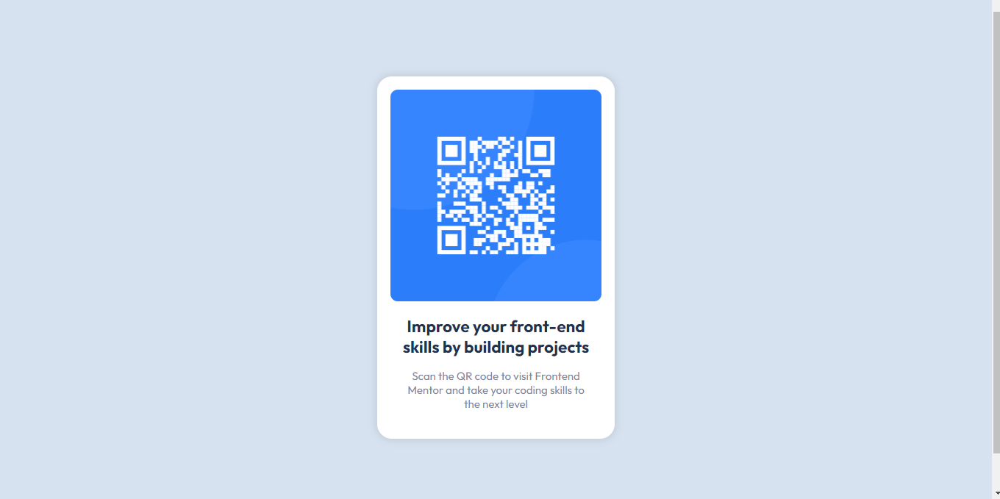

### Screenshot

### Links

- Solution URL: [Add solution URL here](https://github.com/JohnIdenyi/QR-code-component-frontendmentor)
- Live Site URL: [Add live site URL here](https://qr-code-component-design.netlify.app/)

### Built with

- Semantic HTML5 markup
- CSS custom properties
- Flexbox
- CSS Grid
- Desktop-first workflow

### What I learned

I learned hoe to use the toggle-device-toolbar in the chrome developer tools. It helped me to accurately determine the correct layout for different screen sizes.

## Acknowledgments

A big thank you to frontend mentor community who provides feedback to solutions. It has really helped me gain confidence and find things less complicated.